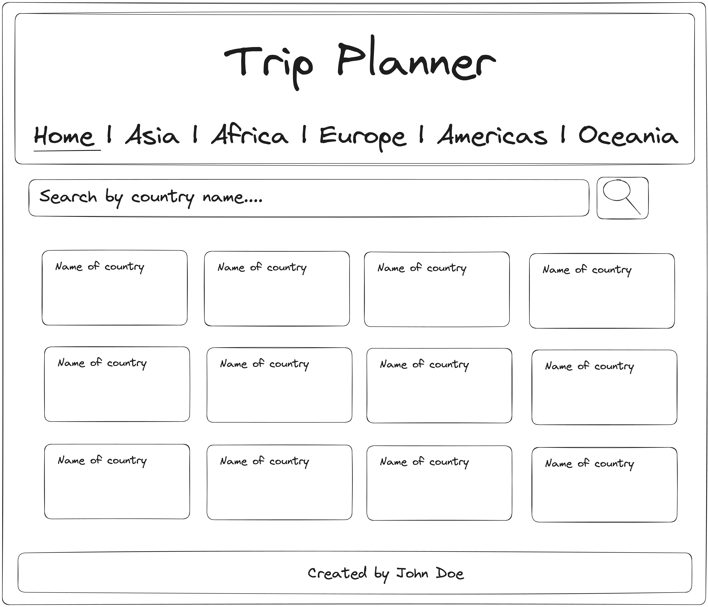

# Homework 2 - Searching for countries

The idea here is to start showing dynamic content based on our actions in the app. To have a more real experience, add at least 10 more countries to the list.

## Task 1: Create a search bar on the home page

- The search bar should allow users to search for countries by name.

- The search should be case insensitive.

- Once a user starts typing, you need to show a list of countries that match the search query.

- The top 10 countries should be shown ONLY if the search input is empty. Also the top 10 countries are fixed and should not change depending on the search query. That is a completely different part of the website and should stay the same as in previous homework.

- The search bar should ONLY be visible on the Home page.

### To implement the search logic you can:

- use a debounce version – results are shown after the user stops typing for a short time (e.g., 500ms), or

- use a Search button – results are displayed after clicking the button.

## FAQs

None at the moment.

## Before you send it...

- Make sure you have a working React app
- Make sure you have node_modules in .gitignore
- Commit your code to a repository
- Send us a link to your repository (to the concrete folder, if you have multiple homeworks)
